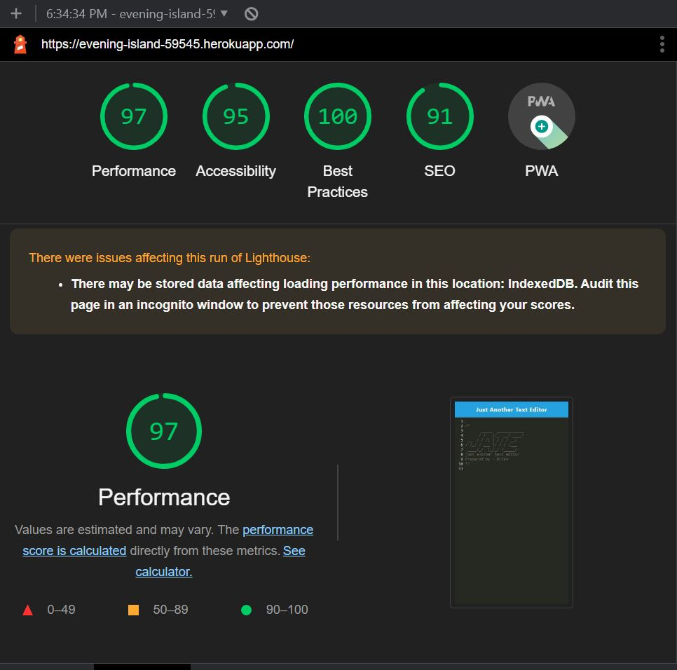
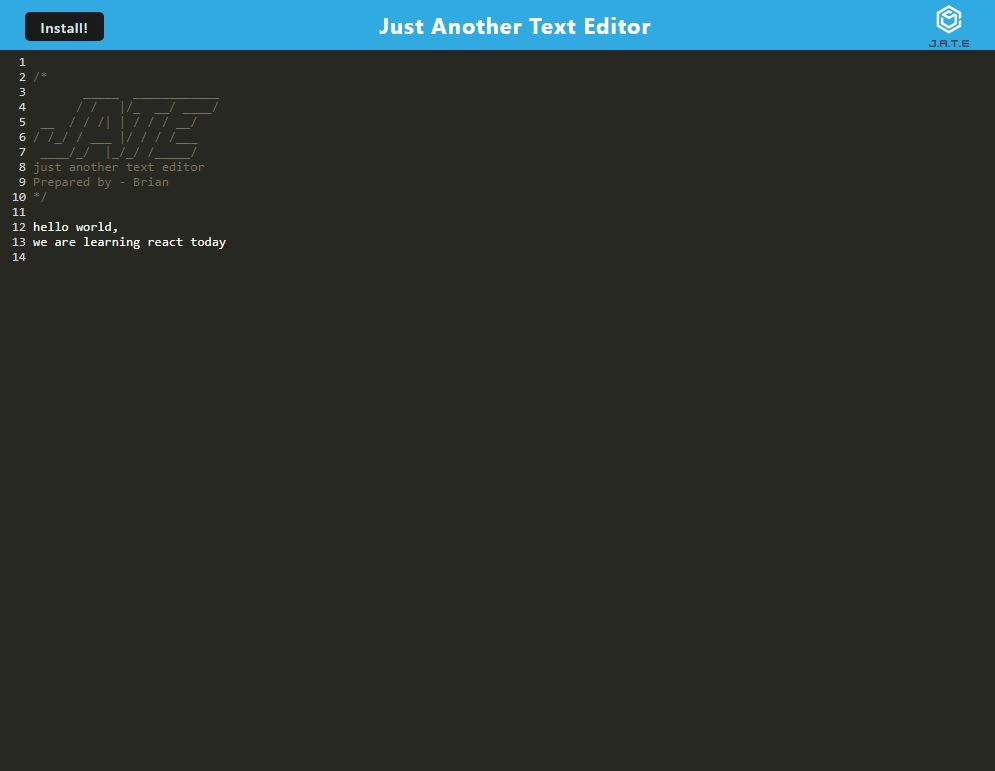

# 19-PWA-Text_editor

## Description

    This is another text editor project. 
    Interesting highlight would be it has server worker, uses indexedDB, and also PWA approved.

The App is being deloyed in Heroku [link](https://evening-island-59545.herokuapp.com/)

    PWA approved
    

## Table of Contents (Optional)

- [Installation](#installation)
- [Usage](#usage)
- [License](#license)
- [Contributing](#contributing)
- [Tests](#tests)
- [Questions](#questions)

## Installation

To install necessary dependencies, run the following command: 

    npm install  

## Usage

Step 1: create dist folder with following command in your terminal:

    npm start 

Step 2: navigate to [localhost:3000](http://localhost:3000) by default:

    localhost:3000

step 3: click on the install button on the page:

example:

## License

N/A

## How to Contribute

N/A

## Tests

N/A
